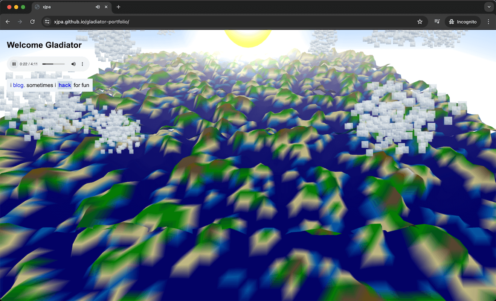

# portfolio

was watching one of the GOAT [hero's journey](https://en.wikipedia.org/wiki/Hero%27s_journey) films, [Gladiator](https://www.imdb.com/title/tt0172495/) and i still cant get enough of it even after many rewatches over the years. That peace as the camera pans to the sky with that music, that's easily the most satisfying ending of all time. So i decided to rework my portfolio to look like the peaceful ending where we pan to the mountains with the glorious music on

todo: make it mobile responsive (has problems with switching from portrait to landscape when on mobile). i may or may not do it, i think not anytime later as i wont use this for my portfolio anyway

# screenshot, v2

- added sun, corona effect, terrain, etc.

